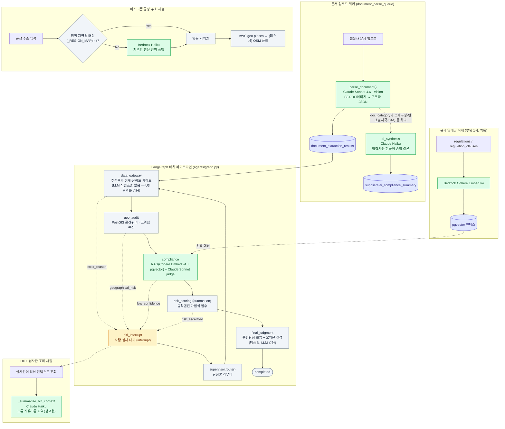

# KIRA Compliance Intelligence Platform

> **N차(다단계) 공급망 추적 · Geo Audit 기반 배터리 규제 컴플라이언스 백엔드**

협력사가 제출한 공급망 데이터를 **데이터 추출 → 지리 감사(geo) → 규제 판정(compliance) → 위험 평가(risk)**까지
자동 파이프라인으로 처리하고, 애매한 건은 사람이 개입(HITL)하는 규제 대응 인텔리전스 플랫폼입니다.
글로벌 배터리·공급망 규제 준수를 N차 공급망 단위로 추적합니다.
> 적용 규제 세트는 `regulations`/`regulation_required_fields` 테이블 기반으로 **데이터 주도**로 관리됩니다.

---

## 핵심 개념

| 개념 | 설명 |
|---|---|
| **N차 공급망 추적** | 원청(prime)부터 말단 광산까지 재귀적으로 추적(`supply_chain_map` 재귀 CTE). 겸업·tier 점프 수용 |
| **Geo Audit** | PostGIS 공간쿼리로 고위험 지역(신장·DRC 등) 좌표 판정 → 지리적 위험 플래그 |
| **HITL** | confidence·규제 위반·지리 위험 등으로 자동 판정이 애매하면 사람 심사 큐로 라우팅 |
| **규제 세트** | 적용 규제·필수필드는 `regulations`/`regulation_required_fields` 테이블 기반(데이터 주도). 스코프에 따라 변동 |

---

## 아키텍처

### 레이어 (단방향)
```
router → service → repository → models
```
- **router**: HTTP 진입점(얇은 라우팅). `db.commit()` 금지.
- **service**: 비즈니스 로직 + 이벤트 발행 + 커밋 일원화. 멀티 write는 단일 트랜잭션 atomic.
- **repository**: 직접 SQL. `flush`까지만.
- **도메인 격리**: 도메인 간 통신은 **이벤트(`events/types.py`) + `publish()`가 기본**. 단 이벤트로 대체 불가능한 두 경우만 상대 도메인 함수 재사용을 허용한다 — ① **동기 조회**(응답을 즉시 만들어야 하는 read; 상대 도메인의 service/repository read 호출), ② **단일 트랜잭션 원자성이 필요한 write**(예: 온보딩 제출→즉시 로그인/중복 즉시 409; 상대 도메인의 **repository까지만**, 커밋 소유는 호출 도메인 service). 예외 적용 시 결정 근거를 코드 주석에 남긴다. (`handlers`·`workers`·`agents`·`hitl`·`main`은 도메인이 아니라 **조립·구독 계층**이라 이 제약 밖 — 도메인 조립은 여기서 한다.)

### 이벤트 기반 (PostgreSQL LISTEN/NOTIFY)
도메인 간 통신은 ~30종 이벤트 계약(`backend/events/types.py`, 팀 전체 SSOT)으로 이뤄집니다.
발행 순서는 **① DB 변경 → ② `await db.commit()` → ③ 커밋 성공 후 `publish()`** (롤백 불일치 방지).

### 에이전트 파이프라인 (LangGraph)
```
stage_queued
  → data_gateway   (supplier_ids·추출결과 검증 — 추출 자체는 문서 업로드 시 워커가 이미 처리)
  → geo_audit      (지리 위험 판정, risk_flags 생성)
  → compliance     (규제별 judge, verdict 판정)
  → risk_scoring   (compliance·geo 결과 종합 점수)
  → final_judgment (종합 판정 롤업 + 요약문 생성)
  → completed
```
공유 상태는 `backend/agents/state.py`의 `BatchState`(schema `batches` 테이블과 1:1 정렬).
HITL 분기는 `error_reason`(`low_confidence`/`geographical_risk`/`risk_escalated`)으로 라우팅됩니다.

### AI vs 결정론 — 그래프 노드 기준 2곳, 전체론 5곳
> **주의**: `data_gateway` 노드 자체는 이미 저장된 추출 결과를 집계·신뢰도 게이트만 하는 결정론 코드다.
> 실제 AI 문서 추출(`parse_document()`, 같은 파일)은 그래프 실행 시점이 아니라 **협력사가 문서를 업로드하는 순간** `document_parse_worker`가 호출한다. 아래 표는 "이 단계의 결과가 AI로 만들어졌는가"를 기준으로 표시한다.

| 노드/모듈 | AI | 기법 |
|---|---|---|
| `supervisor.route()` | ❌ 결정론 | `current_stage`/`confidence_score` 규칙 라우터 (LLM 없음) |
| `data_gateway` | ✅ AI (호출은 워커에서) | Claude Sonnet 멀티모달 문서 추출(AWS Bedrock). S3 PDF/이미지 → 구조화 JSON. 그래프 노드는 결과 집계·신뢰도 게이트만 수행 |
| `geo_audit` | ❌ 결정론 | PostGIS 공간쿼리 + 고위험 좌표 판정 |
| `compliance` | ✅ AI(하이브리드) | RAG(Bedrock Cohere Embed v4 + pgvector 코사인) + Claude Sonnet judge(`cited_clauses` 강제) |
| `automation`(risk_scoring) | ❌ 결정론 | 규칙 엔진: 규제 판정·지리 위험을 종합한 가점식 리스크 점수 |
| `final_judgment` | ❌ 결정론 | verdict·geo·risk를 롤업해 종합판정 + 요약문 생성(파이썬 템플릿, LLM 없음) |

> LLM tool-use(function calling)는 사용하지 않습니다. **구조화 JSON 프롬프트 + RAG** 방식.

### 파이프라인 밖 AI 호출 지점 (총 3곳 추가)
그래프 노드가 아니라 **이벤트/업로드에 반응해 단발로 호출되는** 지점들이다. 모두 `bedrock_factory.get_llm_for_agent("lightweight")`(Claude Haiku)를 공유한다.

| 위치 | 트리거 | 역할 |
|---|---|---|
| `domains/supplier/ai_synthesis.py` | `document_parse_worker`가 문서 파싱 직후 호출 (소재구성·탄소발자국·SAQ 중 하나라도 파싱되면) | 협력사가 읽을 한국어 종합 결론 생성 → `suppliers.ai_compliance_summary` 갱신 |
| `hitl/service.py::_summarize_hitl_context` | 심사관이 HITL 리뷰 컨텍스트를 조회할 때(`get_review_context`) | 보류(HITL) 사유를 3줄 한국어로 요약(참고용, 승인/반려 판단은 하지 않음) |
| `infrastructure/geocode.py::_translate_region` | 마스터폼 공장 주소 저장 시, 정적 지역명 매핑(`_REGION_MAP`)에 없는 지역명일 때만 | 한글/현지어 지역명 → 영문 로마자 표기 1줄 번역 (AWS geo-places/OSM 지오코딩 입력용) |

> 임베딩(Cohere Embed v4)은 `compliance.generate_embedding`(검색 시점)과 `domains/regulation/embeddings.py`(부팅 시 1회, 규제·조항 텍스트를 pgvector에 인덱싱)에서 공유해서 쓴다 — 이건 판단을 만드는 호출이 아니라 RAG 인덱스를 채우는 호출이라 위 표에서는 제외했다.

### AI 에이전트 구조도


---

## 기술 스택

| 영역 | 기술 |
|---|---|
| 웹 | FastAPI 0.110 · Uvicorn · Pydantic v2 |
| DB | PostgreSQL + **PostGIS**(공간) + **pgvector**(임베딩) · SQLAlchemy 2.0(async) · asyncpg · GeoAlchemy2 |
| 큐/비동기 | Redis · ARQ |
| 에이전트 | LangGraph 1.2 · LangChain · langgraph-checkpoint(-postgres) |
| AI | AWS Bedrock (Claude Sonnet 멀티모달 + Cohere Embed v4) via langchain-aws |
| 인증 | JWT (python-jose) · passlib/bcrypt |
| 인프라 | Docker Compose · Nginx(리버스 프록시) · EC2(SSM 배포) |
| 테스트 | pytest · pytest-asyncio · httpx |

---

## 프로젝트 구조

```
backend/
├── main.py                 # FastAPI 진입점 (라우터 등록 · 이벤트 구독)
├── core/config.py          # 설정 (pydantic BaseSettings)
├── agents/                 # LangGraph 오케스트레이션
│   ├── graph.py            #   그래프 빌드 · 체크포인터
│   ├── supervisor.py       #   결정론 라우터
│   ├── state.py            #   BatchState (공유 상태 SSOT)
│   ├── data_gateway.py     #   parse_document(AI 문서추출) + 결정론 집계 노드
│   ├── geo_audit.py        #   PostGIS 지리 위험
│   ├── compliance.py       #   RAG + Sonnet judge
│   ├── automation.py       #   결정론 후처리 (risk_scoring)
│   └── final_judgment.py   #   결정론 종합판정 롤업 + 요약문 생성
├── domains/<name>/         # 도메인별 {router, service, repository, models}.py
│   ├── supplier  supplychain  regulation  product  submission
│   │     (supplier/ai_synthesis.py — AI 협력사용 종합 결론, Haiku, 파이프라인 밖)
│   ├── verification  risk  hitl  audit  batches  users  acl  report
├── events/types.py         # 이벤트 계약 (팀 전체 SSOT)
├── infrastructure/         # database · event_bus(LISTEN/NOTIFY) · queue(ARQ) · auth · trace · geocode(AI 폴백 포함)
├── llm/                    # bedrock_factory · embedding_factory
├── workers/                # ARQ 큐 컨슈머 (document_parse_worker가 AI 추출·종합 트리거)
└── scripts/                # 시드 · 검증 스크립트
docker/
├── 01_schema.sql           # DB 스키마 SSOT (DDL 직접 편집) — 빈 볼륨 최초 init에 적용
├── 02_seed_data.sql        # 4 데모 시나리오 시드
└── *.Dockerfile
ci/                         # 검증 시스템 (smoke · e2e · 컨벤션 체크)
```

---

## 실행

### 사전 요구
- Docker · Docker Compose
- `.env` (아래 환경변수)

### 기동
```bash
docker compose up --build
```
서비스 구성: `nginx`(:80) → `app`(FastAPI :8000) · `db`(PostgreSQL) · `redis` · ARQ 워커
(현재: parse · hitl · pipeline · notification · submission — `docker-compose.yml`이 SSOT, 큐 추가 시 변동)

- API 문서: `http://localhost/docs`
- 헬스체크: `http://localhost/health`

### 스키마 변경 시 — docker/01_schema.sql 직접 편집
- 스키마 DDL의 SSOT는 `docker/01_schema.sql`. 테이블/컬럼/인덱스 변경은 이 파일에 직접 반영한다.
- 데모 데이터 변경은 `docker/02_seed_data.sql`.
- 두 파일은 **빈 볼륨 최초 init**(`docker-entrypoint-initdb.d`)에만 적용된다.
- `down -v && up --build`로 **빈 볼륨에서 스키마 재생성**(데이터 전삭제 — 실데이터 있으면 금지).
- 기존(데이터 보존) DB에 변경을 반영하려면 해당 DDL을 수동으로 1회 적용한다. (alembic 미사용)

### 환경변수(.env)
```
POSTGRES_USER, POSTGRES_PASSWORD, POSTGRES_DB
DATABASE_URL=postgresql+asyncpg://<user>:<pass>@db:5432/<db>
REDIS_URL=redis://redis:6379/0
KIRA_EVENT_CHANNEL=<LISTEN/NOTIFY 채널명>
SECRET_KEY=<JWT 시크릿>
ALLOWED_ORIGINS=http://localhost:3000
# AWS Bedrock: EC2 IAM Role 자동 인증(운영) — 로컬은 자격 별도 필요
```

---

## 데이터베이스

- **스키마 관리**: `docker/01_schema.sql`이 DDL의 SSOT. 변경은 이 파일을 직접 편집한다(alembic 미사용).
  ORM(`models.py`)은 최종 스키마와 1:1 유지.
- **확장**: PostGIS(공간 좌표) · pgvector(규제 임베딩 1536-dim)
- **두 상태축**(`batches`):
  - `current_stage` — 파이프라인 노드 위치 (`stage_*` 접두어). 단계 구성은 스코프에 따라 변동 → `agents/state.py`·schema `chk_batch_stage`가 SSOT
  - `batch_status` — 상위 처리 단계 (`batch_processing`/`batch_hitl_wait`/`batch_completed`/`batch_rejected`)

---

## 데모 시나리오 (`02_seed_data.sql`)

시드는 서로 다른 흐름을 재현하는 데모 제품들을 담는다(구성은 시드가 SSOT, 변동 가능):

| 성격 | 기대 흐름 |
|---|---|
| **Happy** | 전 단계 통과 → batch_completed |
| **Gray** | 저신뢰 추출 → low_confidence → HITL |
| **Sad** | 지리 위험(예: 신장 원산지) → risk 에스컬레이션 → HITL 반려 |

각 제품은 원청→말단까지 `supply_chain_map`에 N차 트리로 연결됩니다.

---

## 테스트 / 검증 (`ci/`)

| 파일 | 역할 |
|---|---|
| `ci/test_smoke.py` | 주요 엔드포인트 생존 (라우터 누락 회귀 방지) |
| `ci/test_e2e.py` | 기능 누적 e2e — write→read 왕복으로 행위 검증 |
| `ci/check_conventions.py` | 아키텍처 규칙 자동 점검 (커밋 경계·datetime 등) |
| `ci/verify.ps1` | 하루 끝 로컬 검증 러너 (오늘 추가 라우트 체크리스트) |

```bash
# docker compose 스택 기동 후
BASE_URL=http://localhost pytest ci/ -v
```

---

## 개발 규칙 (요약)

1. **레이어 단방향**: router → service → repository → models
2. **커밋 경계**: router는 commit 금지. service가 일원화. repository는 flush만.
3. **이벤트 발행 순서**: DB 변경 → commit → **커밋 성공 후** publish
4. **도메인 격리**: 도메인 간 통신은 이벤트 + `publish()`가 **기본**. 예외 — ① 동기 조회 read, ② 단일 트랜잭션 write는 상대 도메인 함수 재사용 허용(근거 주석 필수). 조립·구독 계층(`handlers`·`workers`·`agents`·`hitl`·`main`)은 제약 밖. 상세는 §레이어.
5. **스키마 변경 = `docker/01_schema.sql` 직접 편집**: DDL의 SSOT는 이 파일(alembic 미사용). ORM은 최종 스키마와 1:1.

---

## 배포

- **공유 EC2 배포는 `main` 브랜치 push에서만** (GitHub Actions → OIDC AWS 자격 → SSM RunShellScript).
- 브랜치 작업은 로컬에서. EC2용 스크립트는 UTF-8 인코딩 주의(Windows→Linux).
- 워크플로우: `.github/workflows/deploy.yml`

---

## 이벤트 계약 (발췌)

공급망(`SupplierInvited`·`SupplierConnected`) · 제출(`SubmissionCompleted`·`SubmissionApproved`) ·
검증(`VerificationCompleted`·`GeoRiskDetected`) · 리스크(`RiskEscalated`) · 컴플라이언스(`ComplianceCompleted`) ·
HITL(`HITLRequested`·`HITLApproved`) 등.
전체 정의는 `backend/events/types.py` 참조.
